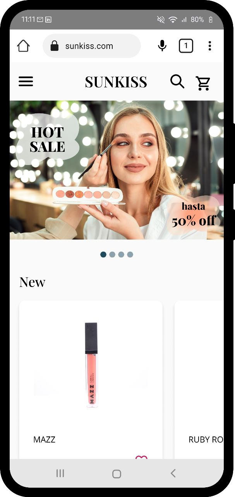
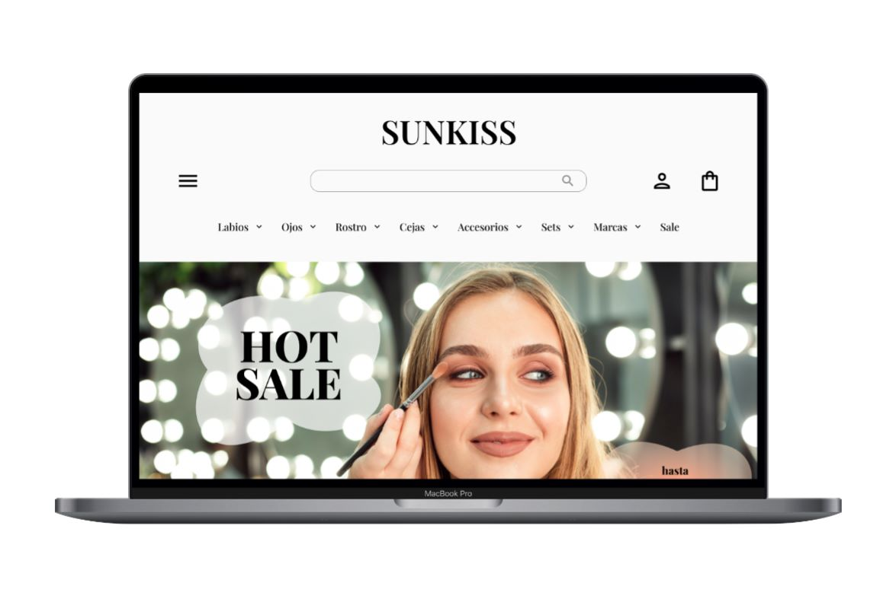

# SUNKISS
Sunkiss es una tienda online de maquillaje con un variado catálogo de marcas tanto nacionales como extranjeras

## Índice

- [Demo](#demo)
- [Descripción](#descripción)
- [Características](#características)
- [Tecnologías Utilizadas](#tecnologías-utilizadas)
- [Equipo](#equipo)
- [Requisitos](#requisitos)
- [Instalación](#instalación)
- [Uso](#uso)
- [Contribución](#contribución)
- [Autor](#autor)
- [Licencia](#licencia)

## Demo

Puedes acceder a la demo del proyecto [aquí](https://c11-35-m-next.vercel.app/).

## Descripción
El propósito principal de nuestro proyecto SUNKISS es abordar el desafío que enfrentan los consumidores de productos de maquillaje en Argentina al tener una limitada disponibilidad de productos importados en el mercado local.

Nuestro objetivo es brindarles una solución completa y satisfactoria al proporcionarles un Ecommerce de maquillaje que les permita acceder a una amplia selección de productos importados, marcas reconocidas, tonos y variedades específicas que se adapten a sus necesidades y preferencias individuales.

| Versión Movil | Versión Desktop |
| :------: | :------: |
| |   |

## Características
Para lograr el objetivo, el proyecto se basa en las siguientes caracter+isticas: 

**1.- Catálogo de productos:** Nuestro Ecommerce cuenta con un extenso catálogo de productos de maquillaje, incluyendo labiales, sombras de ojos, bases, delineadores y más. Los usuarios podrán explorar y filtrar los productos según su tipo, marca y otras características relevantes. Además, cada producto contará con una descripción detallada, imágenes de alta calidad y especificaciones para ayudar a los usuarios a tomar decisiones informadas de compra.

**2.- Carrito de compras:** Implementaremos un sistema de carrito de compras que permitirá a los usuarios agregar los productos seleccionados y gestionar sus pedidos antes de finalizar la compra. Los usuarios podrán ver el resumen de su carrito, ajustar las cantidades y realizar el proceso de pago de manera segura y confiable.

**3.- Creación de perfiles de usuarios:** Los usuarios tendrán la posibilidad de crear perfiles personalizados en nuestro Ecommerce. Estos perfiles les permitirán guardar su información de contacto, direcciones de envío y acceder al historial de pedidos.

**4.- Perfil de administrador:** Los administradores tendrán acceso a un panel de control donde podrán ver y administrar las órdenes. Esto garantizará una gestión eficiente y efectiva de las órdenes y mejorará la experiencia general de los clientes.

## Tecnologías Utilizadas

El proyecto se ha construido utilizando las siguientes tecnologías y herramientas:

-  Lenguaje
-  Framework
-  Despliegue
-  Estilos
-  Manejo de Datos
-  Autenticación y Base de Datos
-  Diseño y Prototipado
-  Pruebas de Usuarios
-  Card Sorting
-  Imágenes

## Equipo de Desarrollo

- [Micaela Samsó](https://www.linkedin.com/in/micaela-sams%C3%B3-b153541b8): Diseñador UX/UI
- [Matias Ferrari](https://www.linkedin.com/in/matias-emanuel-ferrari/): Desarrollador Front-End
- [Daniel Machado](https://www.linkedin.com/in/daniel-machado-4b7ab114/): Desarrollador Front-End

## Requisitos

Enumera los requisitos necesarios para ejecutar o contribuir al proyecto.

## Instalación

Para poder instalar el proyecto debes estar en la carpeta raiz del mismo e introducir los siguientes comandos:

### `npm install`

## Uso

Para ejecutar el proyecto con un servidor local, debes esjecutar el siguiente script

### `npm run dev`

## Contribución

Para contribuir, puedes darle una estrella a nuestro repositorio y agregar funcionalidades.

## Licencia

Este proyecto fue creado bajo licencia de No Country.
